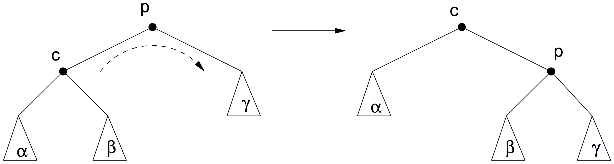
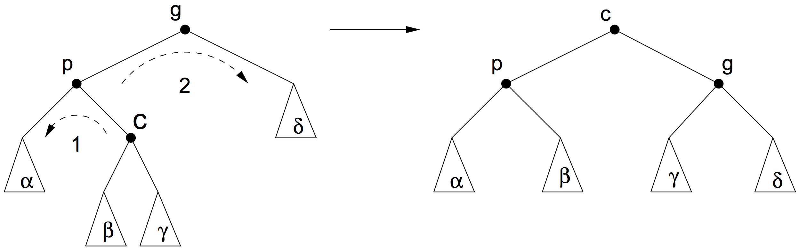
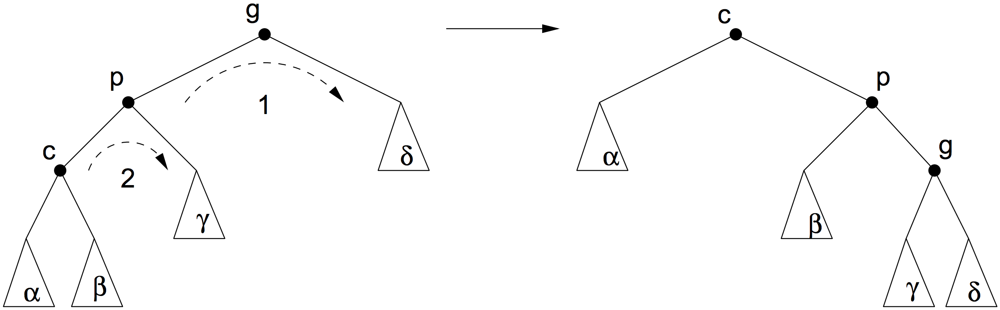

# bottom-up splay trees

A splay tree is a binary search tree where a splay operation is performed after each operation on the tree. The splay operation is performed on the newly added node when an add operation is performed. The splay operation is performed on the parent of the physically deleted node when a delete operation is performed. For a search operation, the node that was searched for is where the splay operation is performed upon.

Cases will be used to explain how a splay operation is performed. The cases described below also count in case the tree is mirrored (left part becomes right part and vice versa).

## Bottom-up splay operation

A splay operation is performed recursively until the node where the splay operation is performed upon becomes the root of the splay tree. To be able to do this, there are 3 cases which can come by when recursively performing the splay operation:

### case 1

After case one, the splay operation is finished since p was the parent which had no parent. This means that it used to be the root of the tree and that the node where the splay operation is performed upon is the root now.

### case 2

After case two, the splay operation is performed again on node c (the node where the splay operation is performed upon).

### case 3

After case three, the splay operation is performed again on node c (the node where the splay operation is performed upon).